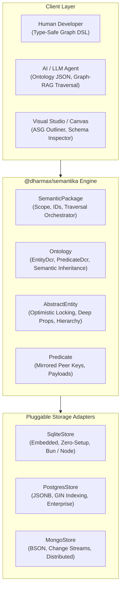

# 🌐 Semantika (`@dharmax/semantika`)
### *The Friendly, Multi-Model Semantic Graph Layer for Modern Apps & AI Agents*

[](https://www.npmjs.com/package/@dharmax/semantika)
[](https://www.typescriptlang.org/)
[]()
[]()
[]()

**Semantika** is a lightweight, zero-bloat semantic graph abstraction layer in TypeScript. It bridges the gap between relational/document databases (SQLite, PostgreSQL JSONB, MongoDB) and knowledge graphs—giving you **typed graph nodes (`AbstractEntity`)**, **first-class semantic edges (`Predicate`)**, **hierarchical ontology inheritance**, **peer-key query optimization**, and **schema validation** without the operational complexity or cost of dedicated graph databases (Neo4j, ArangoDB).

---

## 🏛️ Visual Architecture



---

## 📦 Installation & Driver Matrix

Semantika core is **ultra-lightweight** with zero runtime database dependencies. SQLite drivers are built directly into modern Node and Bun runtimes.

```bash
# Core (Includes embedded SQLite with zero external database dependencies)
npm install @dharmax/semantika

# Optional: Add PostgreSQL driver if using PostgresStore
npm install pg

# Optional: Add MongoDB driver if using MongoStore
npm install mongodb

# Optional: Add Joi if using Joi schema templates
npm install joi
```

---

## ⚡ 60-Second Quickstart (Zero-Config SQLite)

Run immediately with zero database installation or Docker configuration:

```ts
import { 
    SemanticPackage, 
    SqliteStore, 
    AbstractEntity, 
    EntityDcr, 
    PredicateDcr 
} from '@dharmax/semantika';
import * as joi from 'joi';

// 1. Define Entity Schemas
class Developer extends AbstractEntity {
    static template = {
        name: joi.string().required(),
        skill: joi.string().default('Fullstack')
    };
    static readonly dcr = new EntityDcr(Developer, Developer.template);
}

class Project extends AbstractEntity {
    static template = {
        title: joi.string().required()
    };
    static readonly dcr = new EntityDcr(Project, Project.template);
}

// 2. Define Predicates (Edges with mirrored target fields)
const maintains = new PredicateDcr('maintains', [], { target: ['title'] }, { role: joi.string() });

// 3. Initialize Package with In-Memory or File-Backed SQLite
const storage = new SqliteStore(':memory:'); // or new SqliteStore('./graph.db')
await storage.connect();

const sp = new SemanticPackage('main', {
    entityDcrs: [Developer.dcr, Project.dcr],
    predicateDcrs: [maintains]
}, storage);

// 4. Create Entities & Edges
const dev = await sp.createEntity<Developer>(Developer.dcr, { name: 'Alice', skill: 'AI & Systems' });
const proj = await sp.createEntity<Project>(Project.dcr, { title: 'AI Workflow' });

// Connect Alice -> maintains -> AI Workflow
const edge = await sp.createPredicate(dev, maintains, proj, { role: 'Lead Architect' });

// 5. Query Graph Connections (with automatic peer population)
const projects = await dev.outgoingPreds(maintains, { projection: ['title'] });
console.log(projects.map(p => ({ project: p.peer['title'], role: p.payload.role })));
// Output: [ { project: 'AI Workflow', role: 'Lead Architect' } ]
```

---

## 🧩 Core Concepts & Highlights

### 1. Zero-Join Mirrored Peer Keys (`pDcr.keys`)
In traditional multi-model systems, querying graph edges filtered by target node properties requires expensive multi-table joins. Semantika allows predicates to declare mirrored keys:
```ts
const worksFor = new PredicateDcr('worksFor', [], { target: ['companyName', 'industry'] });
```
When `sp.createPredicate(person, worksFor, company)` runs, Semantika copies `_target_companyName` and `_target_industry` directly onto the edge document and automatically indexes them. Edge lookups filter instantly without querying the node collections.

### 2. Semantic Predicate Inheritance
Predicates form ontology trees. Searching for an abstract relation automatically returns specialized sub-relations:
```ts
const contributesTo = new PredicateDcr('contributesTo');
const maintains = new PredicateDcr('maintains', []);
const fixesBugs = new PredicateDcr('fixesBugs', []);

// Define hierarchy
contributesTo.children = [maintains, fixesBugs];

// Querying 'contributesTo' automatically matches 'maintains' and 'fixesBugs'
const allContributions = await dev.outgoingPreds(contributesTo);
```

### 3. Native Optimistic Concurrency Control
Entities and collections enforce atomic optimistic locking via built-in `_version` tracking:
```ts
await entity.update({ status: 'in-review' }); // Atomically increments _version and updates _lastUpdate
```

### 4. Multi-Hop Graph Traversal (`sp.traverse`)
Extract entire subgraphs up to $N$-degrees away in a single declarative call:
```ts
const subgraph = await sp.traverse(rootEntityId, {
    maxDepth: 3,
    direction: 'both',
    predicateTypes: ['dependsOn', 'governs', 'implements']
});
// Returns { entities: [...], predicates: [...] }
```

### 5. Flexible Schema Validation (Joi, Zod, or Zero-Dep Functions)
Semantika supports Joi schemas, Zod schemas, or zero-dependency validator functions:
```ts
// Using zero-dependency custom validator
class Task extends AbstractEntity {
    static template = {
        summary: { validate: (v: any) => typeof v === 'string' ? { value: v } : { error: 'Must be string' } },
        priority: 'medium' // Plain default value
    };
    static readonly dcr = new EntityDcr(Task, Task.template);
}
```

---

## 🤖 AI & Agentic Integration (LLM Context & Studio Tooling)

### 1. Machine-Readable Ontology Introspection
AI agents and visual editors can inspect the active ontology schema dynamically:
```ts
// Export complete ontology schema
const schema = sp.ontology.exportSchema();
console.log(JSON.stringify(schema, null, 2));
```

Inject `sp.ontology.toJSON()` directly into system prompts so LLMs generate 100% schema-conformant entity types and predicate relations without hallucination.

### 2. Graph-RAG Subgraph Context Injection
```ts
// Extract localized knowledge graph around an entity
const subgraph = await sp.traverse('main_Ticket_xyz', { maxDepth: 2 });

const promptContext = `
Context Graph:
Entities: ${subgraph.entities.map(e => `${e.typeName()} (${e.id}): ${JSON.stringify(e)}`).join('\n')}
Relations: ${subgraph.predicates.map(p => `${p.sourceId} --[${p.predicateName}]--> ${p.targetId}`).join('\n')}
`;
```

---

## 💾 Storage Backends & Subpath Imports

Import specific stores cleanly via subpaths:

```ts
// Dedicated subpath imports
import { SqliteStore } from '@dharmax/semantika/sqlite';
import { PostgresStore } from '@dharmax/semantika/postgres';
import { MongoStore } from '@dharmax/semantika/mongo';
```

| Backend | Driver | Configuration Example | Ideal For |
| :--- | :--- | :--- | :--- |
| **`SqliteStore`** | `bun:sqlite` / `node:sqlite` / `better-sqlite3` | `new SqliteStore('./data.db')` or `new SqliteStore(':memory:')` | Embedded apps, CLI tools (`aiwf`), tests, desktop apps |
| **`PostgresStore`** | `pg` (JSONB with GIN indexing) | `new PostgresStore({ connectionString: 'postgres://...' })` | Enterprise relational setups, cloud backends |
| **`MongoStore`** | `mongodb` (Native BSON) | `new MongoStore('mongodb://localhost/db')` | Distributed microservices, high-throughput document graphs |

---

## 📜 API Cheat Sheet

### Entity DSL (`AbstractEntity`)
- `entity.outgoingPreds(pDcr, opts)` / `entity.incomingPreds(pDcr, opts)`
- `entity.outgoingPredsPaging(pDcr, opts, pagination)` / `entity.incomingPredsPaging(...)`
- `entity.p.o(...)` / `entity.p.i(...)` (Shorthand graph navigation)
- `entity.getFieldRecursive(fieldName, accumulate)` (Deep hierarchical property inheritance)
- `entity.drill(inDepth, outDepth)` (Recursive connection graph population)
- `entity.erase()` (Cascading atomic deletion of entity and connected predicates)

### Package DSL (`SemanticPackage`)
- `sp.createEntity(eDcr, fields)`
- `sp.createPredicate(source, pDcr, target, payload?, selfKeys?)`
- `sp.loadEntity(id, eDcr?, ...projection)`
- `sp.loadEntityById(id, ...projection)`
- `sp.predicatesBetween(source, target, bidirectional?, predicateName?)`
- `sp.traverse(startId, { maxDepth, predicateTypes, direction, limit })`

---

## ⚖️ License
MIT © Dharmax
